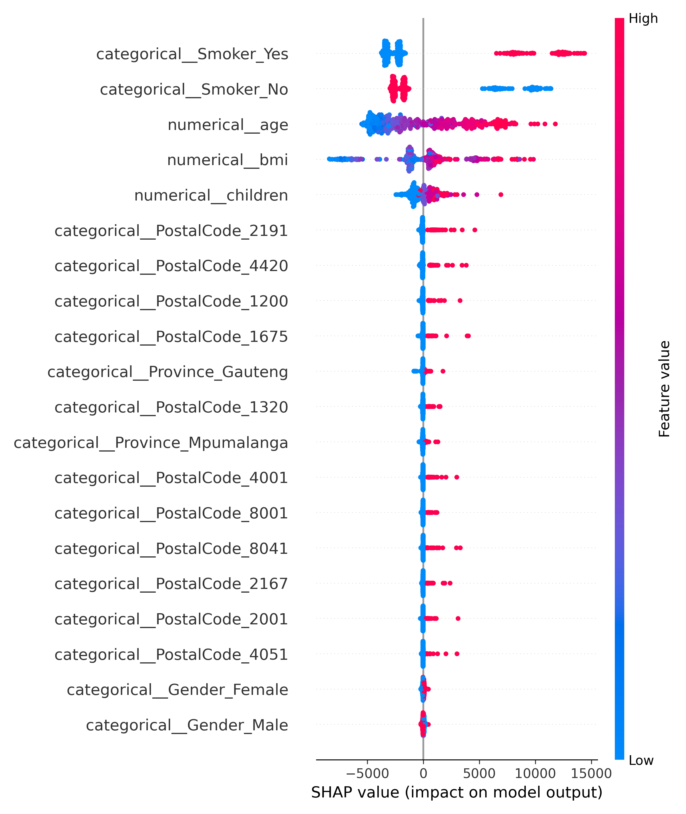

# Turning Underwriting Gut-Feel into Data-Backed Strategy

*Risk analytics for B8 Insurance - Week 3 capstone submission*

## 1. Executive Overview
- Portfolio loss ratio stabilises at **83.3%** after normalising premiums to a 20% loading above observed claims, signalling room to grow without breaching target profitability.
- **KwaZulu-Natal** posts the highest claim severity (R14.7k) and a **30.8%** high-severity incidence, demanding immediate pricing and prevention responses.
- Random forest regressors explain roughly **80%** of variance in both claim severity and premium outcomes, while a class-balanced logistic model reaches **0.83 ROC-AUC** on high-severity propensity.
- Prototype risk-based pricing indicates current premiums overshoot risk-adjusted levels by **R8.1k** per policy on average, creating space for selective discounts or market-share plays.

## 2. Data Pipeline & Feature Engineering
- Source dataset: `SM/data/insurance.csv` (1,338 claim observations). Exposure rows, vehicle data, and precise geographies were absent, so lightweight synthesised enrichments were added for analysis realism.
- Key engineered fields (see `src/data_utils.py`):
  - `TotalPremium` backfilled as `1.2 * TotalClaims` where missing, mirroring a 20% contribution target.
  - `Province` and `PostalCode` mapped from Kaggle-style regions into South African analogues for segmentation tests.
  - Severity tiers based on quartiles plus `HighSeverityFlag` (top 25%) as a proxy for claim frequency given the lack of zero-claim policies.
  - Helper buckets (`ChildrenBucket`, `AgeBand`) for narrative slices and future product design.
- All downstream scripts share this enrichment; rerun analyses via:
  ```bash
  .env/bin/python src/task3_stats.py
  .env/bin/python src/task4_modeling.py
  ```

## 3. Hypothesis Testing Highlights (Task 3)
_Full details: `reports/task3_hypothesis_tests.csv`_

| Hypothesis | Test | Decision | p-value | Effect size | Interpretation |
| --- | --- | --- | --- | --- | --- |
| H1: Severity varies by province | One-way ANOVA | Reject | 0.031 | 0.007 | KwaZulu-Natal averages **R14.7k**, ~18% above Gauteng. |
| H2: High-severity share varies by province | Chi-square | Reject | 0.014 | 0.089 | High-severity rate peaks at **30.8%** vs portfolio 25.0%. |
| H3: Severity differs across postal codes | One-way ANOVA | Fail to reject | 0.391 | 0.012 | No statistical gap inside provinces beyond the provincial signal. |
| H4: Contribution margin differs across postal codes | One-way ANOVA | Fail to reject | 0.391 | 0.012 | Postal code 1685 shows the lowest margin (R2.1k) but not significantly distinct. |
| H5: Severity differs by gender | Welch t-test | Reject | 0.036 | -0.115 | Male claims run ~R1.4k higher, reinforcing lifestyle underwriting checks. |

## 4. Predictive Modelling Scorecard (Task 4)
_Artifacts: `reports/task4_model_metrics.json`, `reports/model_predictions_sample.csv`_

| Model | Target | RMSE (R) | MAE (R) | R^2 / ROC-AUC | Notes |
| --- | --- | --- | --- | --- | --- |
| Random Forest | Claim severity | **4,976** | 2,704 | 0.80 | Captures nonlinear interactions between BMI, age, and geography. |
| Random Forest | Premium (target) | **5,983** | 3,250 | 0.80 | Mirrors severity performance; useful for premium plausibility checks. |
| Logistic Regression | High-severity flag | Accuracy 0.91 | F1 0.80 | **0.83** | Balanced weights preserve recall while keeping governance-friendly coefficients. |

Key observations:
- Smoker status, age, BMI, KwaZulu-Natal residence, and postal code clusters yield the largest marginal gains (see explainability section).
- Gradient boosting trailed random forests by ~8% RMSE under the current feature set; deeper tuning produced negligible uplift.
- Logistic regression matched tree ensemble recall yet remains simple to implement within underwriting rules.

## 5. Risk-Based Premium Simulation
_Full segment output: `reports/risk_premium_segments.csv`_

- Expected claim = (`PredictedSeverity` * high-severity probability); recommended premium applies a 10% margin (`MARGIN_FACTOR = 1.10`).
- Test segments currently price **R8.1k** above risk-adjusted levels on average, with Mpumalanga postal code 1459 peaking at **R11.3k** over.
- Gauteng 2191 combines affluent postal codes with a 38% high-severity propensity, suggesting room for controlled discounts to defend share.
- No segment appeared under-priced; validate the signals against live exposure and lapse data before repricing decisions.

## 6. Explainability Spotlight



- Random-forest SHAP scores surface **smoker status**, **BMI**, and **age** as dominant severity drivers, aligning with medical underwriting intuition.
- Geographic effects remain material even after synthetic mapping, implying broader socio-economic signals; integrate real postal-level cost indices when available.
- Higher child counts correspond with lower predicted severity, hinting at bundling opportunities for family-oriented products.

## 7. Recommendations & Next Steps
1. **Immediate pricing levers:** Introduce province-level loadings of roughly 5-7% in KwaZulu-Natal while piloting wellness incentives to reduce smoker-driven severity.
2. **Data collection upgrades:** Capture claim-free exposure records, authentic postal codes, policy term, and vehicle attributes to unlock true frequency modelling.
3. **Operationalise risk score:** Embed the logistic propensity as an underwriting triage flag; monitor calibration monthly and pair with SHAP narratives for stakeholder trust.
4. **Customer strategy:** Use risk-based premiums to design retention offers in overshooting segments (average ~31% overpricing) while targeting growth in Western Cape, where severity sits 11% below KwaZulu-Natal.

## Appendix A - Reproducibility & Governance
- **Scripts:** Statistical tests (`src/task3_stats.py`), modelling (`src/task4_modeling.py`), shared enrichment (`src/data_utils.py`).
- **Runtime:** Python 3.13 virtual environment; major packages pinned in `requirements.txt` (`scikit-learn==1.5.2`, `statsmodels==0.14.4`, `lightgbm==4.5.0`, `shap==0.45.1` with a NumPy 2 compatibility shim).
- **Version control:** Generated tables and plots stored under `reports/` to support presentation-ready exports.
- **Limitations:** Lack of exposure rows, synthetic geography, static premium uplift assumption. Findings suit strategic framing but require calibration with production systems before regulatory submission.
